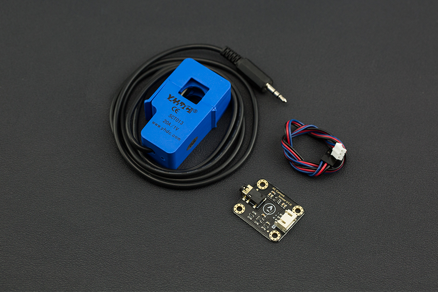

# DFRobot_AnalogACurrentSensor
* [中文版](./README_CN.md)

When you want to measure AC current, it is common to have trouble cutting the wires, wiring or soldering. The Gravity: Analog AC Current Sensor comes to the rescue, eliminating the need to cut wires or reconnect circuits. Simply clamp the AC transformer probe on the AC line, and then plug the 3.5mm headphone jack into the signal conversion module to read the current AC current value. The analog output is designed to be compatible with 3V3/5V micro-controller. It can be conveniently used for AC current measurement to monitor AC motors, lighting equipment, air compressors, etc.




## Product Link (https://www.dfrobot.com/)
    SKU: SEN0287/SEN0288/SEN0211


## Table of Contents

* [Summary](#summary)
* [Installation](#installation)
* [Methods](#methods)
* [Compatibility](#compatibility)
* [History](#history)
* [Credits](#credits)


## Summary

* Non-contact measurement, high safety
* Multiple ranges for various measurement scenarios
* Compatible with 3V3/5V micro-controller


## Installation

There two methods:

1. To use this library, first download the library file, paste it into the \Arduino\libraries directory, then open the examples folder and run the demo in the folder.
2. Search the DFRobot_AnalogACurrentSensor library from the Arduino Software Library Manager and download it.


## Methods

```C++

  /**
   * @fn readACCurrentValue
   * @brief read AC Current Value
   * @return Returns the measured AC current value, unit: A
   */
  float readACCurrentValue(void);

```


## Compatibility

MCU                | Work Well    | Work Wrong   | Untested    | Remarks
------------------ | :----------: | :----------: | :---------: | -----
Arduino Uno        |      √       |              |             | 
Mega2560        |      √       |              |             | 
Leonardo        |      √       |              |             | 
ESP32        |      √       |              |             | 
ESP8266        |      √       |              |             | 
M0        |      √       |              |             | 


## History

- 2022/05/20 - Version 1.0.0 released.


## Credits

Written bernie chen(bernie.chen@dfrobot.com), 2022. (Welcome to our [website](https://www.dfrobot.com/))

