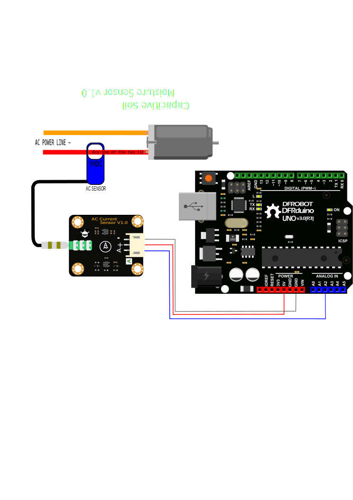

# DFRobot_AnalogACurrentSensor
- [English Version](./README.md)

当你想要测量交流电流的时候，你是不是还在为怎么剪线，接线，搭电路感到烦恼。DF出品的模拟量交流电流传感器能够很方便的帮助您解决这个问题，不再需要您剪线，搭电路。只需要将我们的开合式交流互感器打开套在您的交流线上，然后将交流互感器的3.5mm耳机插头插到我们的模块上，就可以方便快捷的读取到当前的交流电流值。即插即用，随套随测。可以很方便的用于交流电机、照明设备、空压机等的电流测量、监控和保护。




## 产品链接 (https://www.dfrobot.com.cn/search.php?keywords=%E4%BA%A4%E6%B5%81%E7%94%B5%E6%B5%81%E4%BC%A0%E6%84%9F%E5%99%A8)
  SKU: SEN0287/SEN0288/SEN0211

## Table of Contents

  * [概述](#概述)
  * [库安装](#库安装)
  * [方法](#方法)
  * [兼容性](#兼容性)
  * [历史](#历史)
  * [创作者](#创作者)

## Summary

* 非接触测量，高安全性
* 多种量程，适应各类测量场景
* 适用于3V3/5V主控板


## Installation

这里有2种安装方法：

1. 使用此库前，请首先下载库文件，将其粘贴到\Arduino\libraries目录中，然后打开examples文件夹并在该文件夹中运行演示。
2. 直接在Arduino软件库管理中搜索下载 DFRobot_AnalogACurrentSensor 库。


## 方法

```C++

  /**
   * @fn readACCurrentValue
   * @brief 读取交流电流值
   * @return 返回测量得到的交流电电流值，单位A
   */
  float readACCurrentValue(void);

```


## 兼容性

MCU                | Work Well    | Work Wrong   | Untested    | Remarks
------------------ | :----------: | :----------: | :---------: | -----
Arduino Uno        |      √       |              |             | 
Mega2560        |      √       |              |             | 
Leonardo        |      √       |              |             | 
ESP32        |      √       |              |             | 
ESP8266        |      √       |              |             | 
M0        |      √       |              |             | 


## 历史

- 2022/05/20 - 1.0.0 版本


## 创作者

Written bernie chen(bernie.chen@dfrobot.com), 2022. (Welcome to our [website](https://www.dfrobot.com/))

